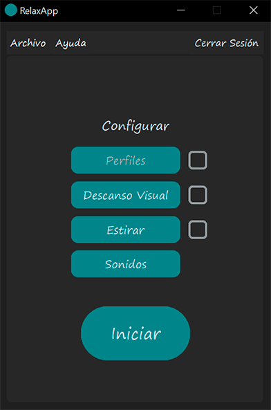
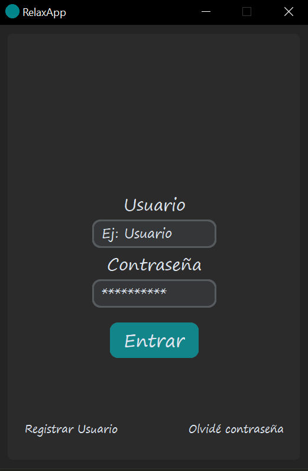
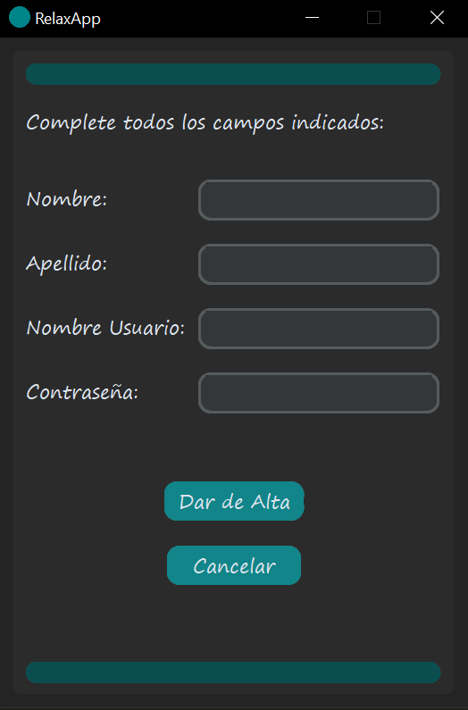
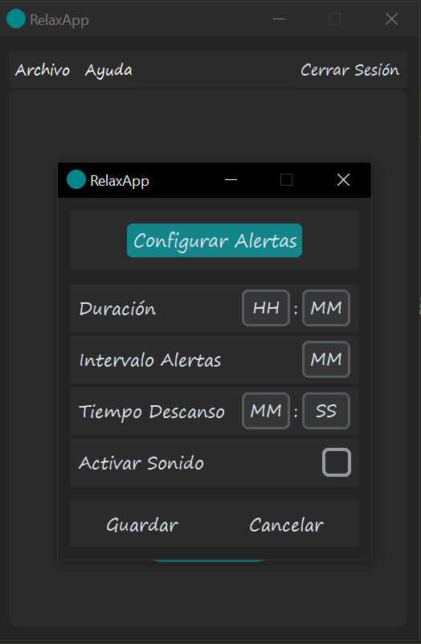
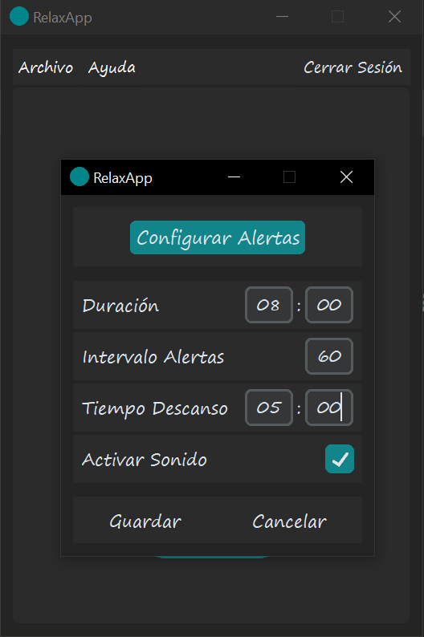
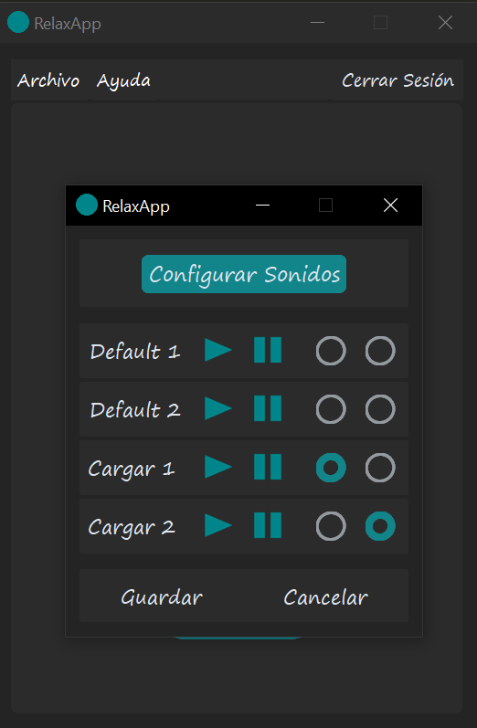
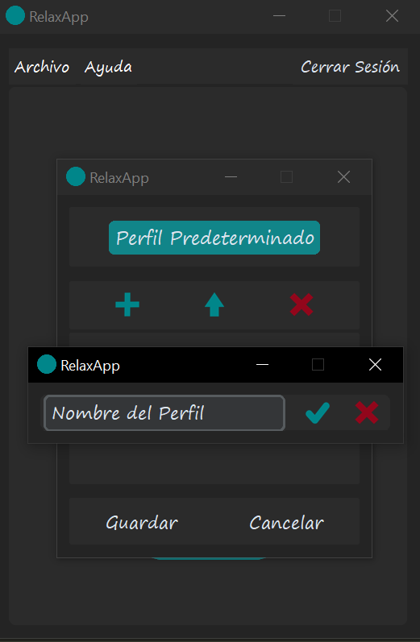
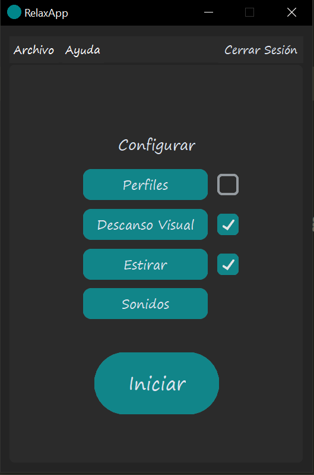

# RelaxApp

#### Aplicación de escritorio creada para gestionar descansos musculares y visuales. Permite personalizar temporizadores y establecer alertas mientras estés realizando alguna actividad en particular.

#### >> Inicialmente el menú principal te permite iniciar sesión, registrarte o cambiar tu contraseña:

#### >> El menú de registro pide datos básicos necesarios para comenzar a utilizarla: 

#### >> Una vez logueado, verás todas las opciones para configurar la aplicación:

 

#### >> Si elijes el sub-menú de descanso visual o de estirar podrás establecer la configuración general. La duración hace referencia al tiempo en horas y minutos que la aplicación está realizando una cuenta atrás. El intervalo define cuanto tiempo en minutos pasa entre descanso y descanso configurado. Finalmente, el tiempo de descanso es la duración establecida antes de volver a tu actividad principal.

#### >> Así quedaría un ejemplo de la aplicación configurada. 

#### >> Es decir, durante 8hs, descansarás 5 minutos cada 60 minutos que hayan pasado. Además, puedes elegir un sonido para te informe cuando un descanso comienza y cuando termina. Cómo configurarlo se explicará a continuación.

#### >> RelaxApp te permite gestionar los sonidos a tu manera. Por un lado, tendrás para seleccionar 2: uno será para cada alerta de descanso y el otro para cuando la cuenta atrás haya finalizado. Al mismo tiempo, hay 2 sonidos por default pero también puedes importar tus propias alarmas en los formatos permitidos:

#### >> Una vez tengas tus opciones configuradas podrás acceder al menú de "Perfiles" para guardarlos y no tener que configurarlos cada vez que inicies la app. Puedes guardas hasta 3 distintos y adaptarlos a tus actividades cotidianas:

#### >> Cuando tengas todo listo, deberás elegir al menos una opción para iniciar RelaxApp. Puedes elegir "Descanso Visual", "Estirar" o los dos:

#### >> Finalmente, RelaxApp comenzará la cuenta atrás con lo que hayas configurado o el perfil que tengas establecido por defecto. Mientras el tiempo restante va disminuyendo, el descanso comenzará cuando el intervalo haya finalizado. Cuando este descanso termine, dará inicio nuevamente al intervalo y así sucesivamente hasta que el tiempo restante sea cero. Aquí se ve un ejemplo de la aplicación en funcionamento:

https://github.com/L3chuS/Relaxapp/assets/144654765/e4e71781-4ff4-48f2-a00d-d74cab3eb104

##  Hola, soy Esteban Santos Mendoza!!  

#### Soy informático que trabaja hace 5 años en el mundo del soporte técnico. Actualmente me estoy formando como desarrollador en Python.
#### En mi perfil de GitHub tienes más información sobre mi. Saludos!

