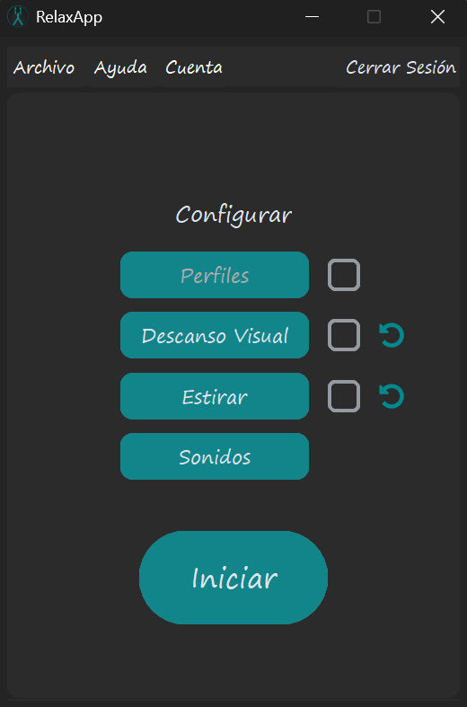
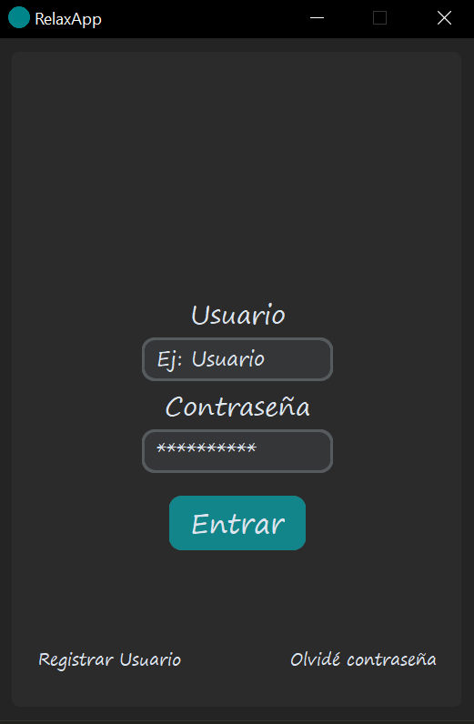
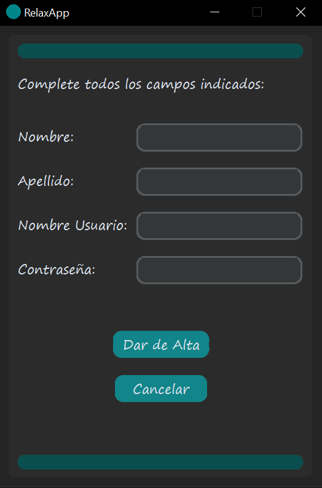
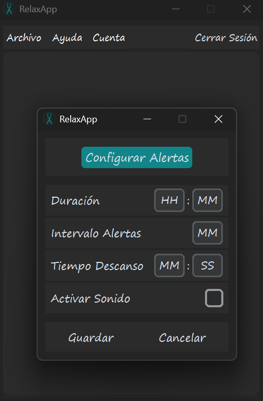
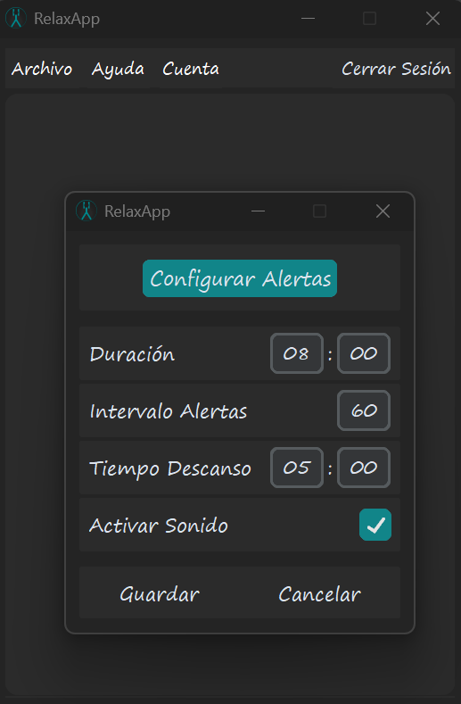
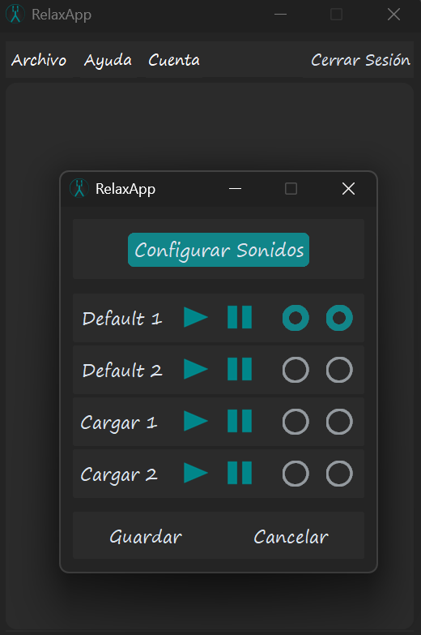
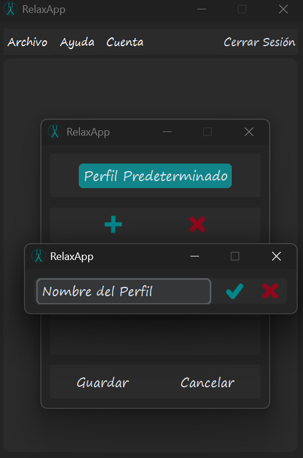
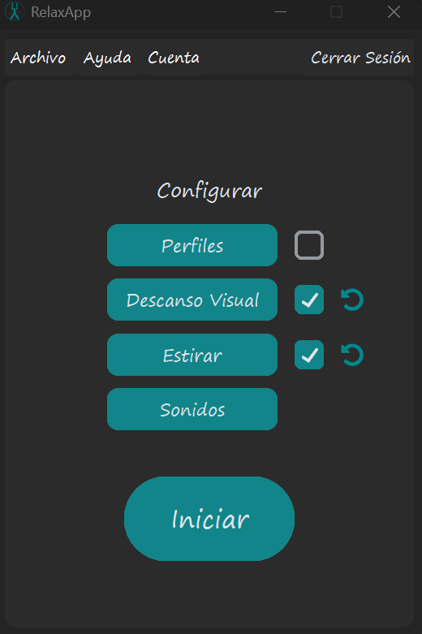

# RelaxApp

---
### Qué es RelaxApp?

#### Es una aplicación de escritorio creada para gestionar descansos musculares y visuales. Permite personalizar temporizadores y establecer alertas mientras estés realizando alguna actividad en particular.

---

### Tecnologías utilizadas

#### >> Python 3: Lenguaje de desarrollo
#### >> Customtkinter: Interfaz gráfica
#### >> MySql-connector-python: Conexión a la base de datos
#### >> Railway: Base de datos en la nube
#### >> Pygame: Gestión de sonidos
#### >> Dotenv: Gestión de variables de entorno
#### >> Werkzeug: Encriptar contraseñas

---

### Instalación usuarios finales:

#### 1 - Ejecuta el archivo "RelaxApp.exe" ubicado en la carpeta principal descargada.
#### 2 - Sigue los pasos indicados por el instalador hasta finalizar.
#### 3 - Inicia la aplicación.
#### 4 - En el menú de inicio registra tu usuario desde el botón ubicado a la izquierda abajo.
#### 5 - Completa los campos requeridos y pulsa aceptar.
#### 6 - Disfruta de RelaxApp.

---

### Instalación desarrolladores:

#### 1 - Clona el repositorio: https://github.com/L3chuS/Relaxapp.git
#### 2 - Instala las dependencias.
#### 3 - Crea un archivo ".env" con los datos del servidor MySQL.
#### 4 - Ejecuta RelaxApp.

---

### Primeros pasos:

#### >> Inicialmente el menú principal te permite iniciar sesión, registrarte o cambiar tu contraseña:

#### >> El menú de registro pide datos básicos necesarios para comenzar a utilizarla: 

---

### Cómo funciona?

#### >> Una vez logueado, verás todas las opciones para configurar la aplicación:

 

#### >> Si elijes el sub-menú de descanso visual o de estirar podrás establecer la configuración general. Allí verás distintos campos a configurar:
* Duración: hace referencia al tiempo en horas y minutos que el usuario prevee que estará realizando la actividad.
* Intervalo Alertas: define cuanto tiempo en minutos transcurre entre cada descanso.
* Tiempo Descanso: es la duración establecida antes de volver a tu actividad principal.
* Activar sonido: permite habilitar una alerta sonora cada vez que haya un descanso o cuando la aplicación finalice.

#### >> Así quedaría un ejemplo de la aplicación configurada:

#### >> Es decir, durante 8hs, descansarás 5 minutos cada 60 minutos que hayan pasado.

#### >> RelaxApp te permite gestionar los sonidos a tu manera. Tendrás para seleccionar 2:
* Uno será para cada alerta de descanso.
* El otro para cuando la cuenta atrás haya finalizado.
#### >> Al mismo tiempo, hay 2 sonidos por default pero también puedes importar tus propias alarmas en los formatos permitidos:

#### >> Una vez tengas tus opciones configuradas podrás acceder al menú de "Perfiles" para guardarlos y no tener que configurarlos cada vez que inicies la app. Puedes guardas hasta 3 distintos y adaptarlos a tus actividades cotidianas:

---

### Comenzando:

#### >> Cuando tengas todo listo, deberás elegir al menos una opción para iniciar RelaxApp. Puedes elegir "Descanso Visual", "Estirar" o los dos:

#### >> Finalmente, RelaxApp comenzará la cuenta atrás con lo que hayas configurado o el perfil que tengas establecido por defecto. Mientras el tiempo restante va disminuyendo, el descanso comenzará cuando el intervalo haya finalizado. Cuando este descanso termine, dará inicio nuevamente al intervalo y así sucesivamente hasta que el tiempo restante sea cero. Aquí se ve un ejemplo de la aplicación en funcionamiento:

https://github.com/user-attachments/assets/c9dd7898-b509-4b72-9e90-49ce7248c5a5

---

### Autor:

#### Nombre: Esteban Santos Mendoza
#### Github: https://github.com/L3chuS

---

#  Hola, soy Esteban Santos Mendoza!! 👋 

### Soy informático que trabaja hace 6 años en el mundo del soporte técnico. Actualmente me estoy formando como desarrollador en Python y estudiando un grado superior en el IOC (Institut Obert de Catalunya) en Desarrollo de Aplicaciones Web.
### En mi perfil de GitHub tienes más información sobre mi. Saludos!
